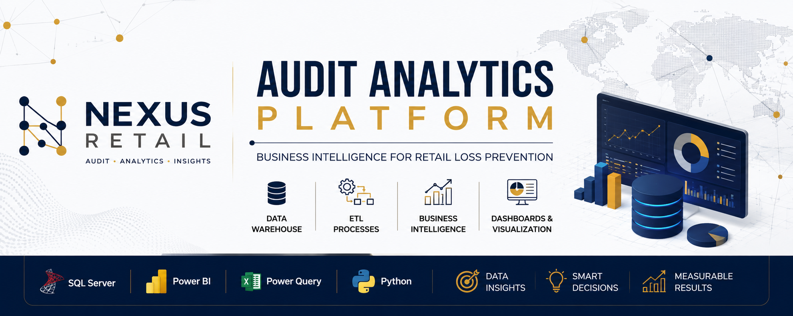

<div align="center">



# Audit Analytics Platform

### 📊 Business Intelligence • Data Warehouse • SQL Server • Power BI

Projeto de portfólio que simula uma plataforma corporativa de Business Intelligence para monitoramento e análise de perdas no varejo, desenvolvido seguindo as principais etapas utilizadas em projetos reais de BI.

<p>


</p>

</div>

---

# 📖 Sobre o Projeto

A **Audit Analytics Platform** é um projeto de Business Intelligence desenvolvido para demonstrar a construção completa de uma solução analítica voltada ao monitoramento de perdas no varejo.

O projeto simula todas as etapas encontradas em um ambiente corporativo, desde o levantamento dos requisitos de negócio até a implementação de um Data Warehouse e a criação de dashboards estratégicos.

Ao longo do desenvolvimento serão aplicados conceitos de:

- Business Intelligence
- Data Warehouse
- Modelagem Dimensional
- ETL
- SQL Server
- Power BI
- Governança de Dados

> **Aviso**
>
> A empresa **Nexus Retail** utilizada neste projeto é fictícia e foi criada exclusivamente para fins educacionais e demonstração de competências técnicas.

---

# 🎯 Objetivos

✔ Centralizar informações de auditoria

✔ Padronizar indicadores de desempenho

✔ Construir um Data Warehouse

✔ Desenvolver processos ETL

✔ Disponibilizar dashboards gerenciais

✔ Simular um projeto corporativo de Business Intelligence

---

# 🏗 Arquitetura da Solução

```text
                  ERP / Sistemas Operacionais
                             │
                             ▼
                     Power Query (ETL)
                             │
                             ▼
                      SQL Server DW
                             │
            ┌────────────────┴────────────────┐
            ▼                                 ▼
         Views                         Stored Procedures
            │                                 │
            └────────────────┬────────────────┘
                             ▼
                        Power BI Dataset
                             │
                             ▼
                    Dashboards Executivos
```

---

# 🛠 Tecnologias

| Área | Tecnologias |
|------|-------------|
| Business Intelligence | Power BI, Power Query, Excel |
| Banco de Dados | SQL Server, PostgreSQL, Supabase |
| Linguagens | SQL, Python |
| Desenvolvimento | Git, GitHub, Streamlit |

---

# 📂 Estrutura do Projeto

```text
audit-analytics-platform/
│
├── docs/
│   ├── NR-001_Project_Charter.pdf
│   ├── NR-002_Business_Requirements.pdf
│   ├── NR-003_KPI_Catalog.pdf
│   ├── NR-004_Data_Dictionary.pdf
│   ├── NR-005_Data_Model.pdf
│   └── NR-006_SQL_Database_Design.pdf
│
├── database/
│   ├── schema/
│   ├── tables/
│   ├── views/
│   ├── procedures/
│   ├── functions/
│   ├── indexes/
│   └── migrations/
│
├── etl/
│
├── powerbi/
│
├── dashboard/
│
├── images/
│
└── README.md
```

---

# 📚 Documentação

| Documento | Descrição | Status |
|------------|-----------|--------|
| ✅ NR-001 | Project Charter | Concluído |
| ✅ NR-002 | Business Requirements Document | Concluído |
| ✅ NR-003 | KPI Catalog | Concluído |
| ✅ NR-004 | Enterprise Data Dictionary | Concluído |
| ✅ NR-005 | Data Model Specification | Concluído |
| ✅ NR-006 | SQL Database Design | Concluído |
| 🔄 NR-007 | ETL Specification | Em desenvolvimento |

---

# 🚀 Roadmap

## Fase 1 — Planejamento ✔

- [x] Project Charter
- [x] Business Requirements
- [x] KPI Catalog
- [x] Data Dictionary
- [x] Data Model
- [x] SQL Database Design

---

## Fase 2 — Banco de Dados

- [ ] SQL Server
- [ ] Tabelas
- [ ] Views
- [ ] Stored Procedures
- [ ] Índices

---

## Fase 3 — ETL

- [ ] Power Query
- [ ] Limpeza dos Dados
- [ ] Transformações
- [ ] Carga Incremental

---

## Fase 4 — Business Intelligence

- [ ] Modelo Power BI
- [ ] Medidas DAX
- [ ] Dashboard Executivo
- [ ] Dashboard Gerencial
- [ ] Dashboard Operacional

---

# 📸 Prévia do Projeto

> Em breve serão adicionadas imagens da arquitetura, modelo dimensional, banco de dados e dashboards desenvolvidos ao longo da implementação.

---

# 🤝 Contribuições

Este é um projeto de portfólio desenvolvido para fins de estudo e demonstração de competências em Business Intelligence e Engenharia de Dados. Sugestões e feedbacks são sempre bem-vindos.

---

# 👩‍💻 Desenvolvido por

**Alessandra Lira**

- 💼 Business Intelligence
- 📊 Data Analytics
- 🗄 SQL
- 🐍 Python
- 📈 Power BI

LinkedIn: https://www.linkedin.com/in/alessandra-lira-oliveira/

GitHub: https://github.com/AlleLira
